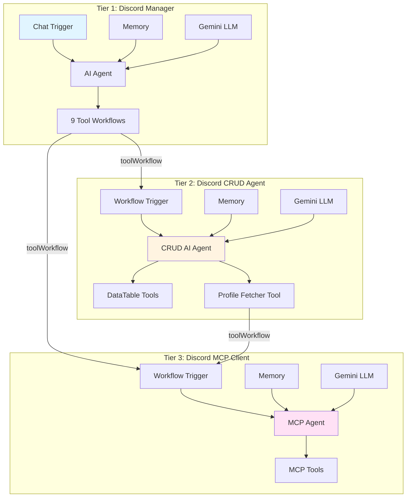

# n8n Discord Workflow Architecture Documentation

## Table of Contents

1. [Introduction](#introduction)
2. [Architecture Overview](#architecture-overview)
3. [Node Types and Patterns](#node-types-and-patterns)
4. [JSON Standards](#json-standards)
5. [Connection Patterns](#connection-patterns)
6. [Expression Patterns](#expression-patterns)
7. [Common Configurations](#common-configurations)
8. [Workflow-Specific Documentation](#workflow-specific-documentation)
9. [Best Practices](#best-practices)
10. [Troubleshooting and Common Pitfalls](#troubleshooting-and-common-pitfalls)

---

## Introduction

This documentation provides a comprehensive technical reference for the Discord workflow automation system built with n8n. The system consists of three interconnected workflows that enable AI-powered Discord interactions through a hierarchical architecture.

### Purpose

This README serves as:
- A reference guide for understanding workflow structure and JSON standards
- Documentation of patterns and conventions used across workflows
- A guide for maintaining and extending the system
- Technical documentation for developers working with these workflows

### System Overview

The Discord workflow system provides:
- **AI-powered Discord interactions** using LangChain agents
- **Contact database management** via DataTable CRUD operations
- **MCP (Model Context Protocol) integration** for Discord API access
- **Workflow-to-workflow communication** enabling modular architecture
- **Structured output parsing** for reliable data handling

---

## Architecture Overview

### Three-Tier Workflow Hierarchy

The system follows a three-tier architecture pattern:

```
┌─────────────────────────────────────────────────────────┐
│  Tier 1: Discord Manager                                 │
│  - Entry point with chat interface                       │
│  - Orchestrates high-level operations                    │
│  - Tool workflow coordination                            │
└───────────────┬─────────────────────────────────────────┘
                │
                ├──► Calls
                │
┌───────────────▼─────────────────────────────────────────┐
│  Tier 2: Discord CRUD Agent                              │
│  - Specialized CRUD operations                           │
│  - DataTable management                                  │
│  - Profile fetching and caching                          │
└───────────────┬─────────────────────────────────────────┘
                │
                ├──► Calls
                │
┌───────────────▼─────────────────────────────────────────┐
│  Tier 3: Discord MCP Client                               │
│  - Low-level MCP tool execution                          │
│  - Discord API integration                               │
│  - Tool discovery and registry                           │
└───────────────────────────────────────────────────────────┘
```

**Mermaid Diagram**:


### Workflow Dependencies

1. **Discord Manager** (`Discord Manager.json`)
   - **Trigger**: Chat interface (`@n8n/n8n-nodes-langchain.chatTrigger`)
   - **Dependencies**: Calls Discord CRUD Agent and Discord MCP Client as tools
   - **Purpose**: Main user-facing interface for Discord operations

2. **Discord CRUD Agent** (`Discord Crud Agent.json`)
   - **Trigger**: Workflow execution (`n8n-nodes-base.executeWorkflowTrigger`)
   - **Dependencies**: Calls Discord MCP Client for profile fetching
   - **Purpose**: Manages Discord contact database via DataTable operations

3. **Discord MCP Client** (`Discord MCP Client.json`)
   - **Trigger**: Workflow execution (`n8n-nodes-base.executeWorkflowTrigger`)
   - **Dependencies**: None (leaf node in hierarchy)
   - **Purpose**: Executes Discord MCP tools and provides Discord API access

### Data Flow

1. User input enters via chat trigger → **Discord Manager**
2. Manager AI agent analyzes request and selects tools
3. Tools may call → **Discord CRUD Agent** or **Discord MCP Client**
4. CRUD Agent may call → **Discord MCP Client** for profile data
5. Results flow back through the hierarchy with structured outputs

---

## Node Types and Patterns

### LangChain Agent Nodes

**Type**: `@n8n/n8n-nodes-langchain.agent`  
**Type Version**: `3`

The core AI agent node that orchestrates tool selection and execution.

**Common Parameters**:
```json
{
  "parameters": {
    "promptType": "define",
    "text": "={{ $json.inputField }}",
    "hasOutputParser": true,
    "options": {
      "systemMessage": "Detailed system instructions..."
    }
  }
}
```

**Pattern**:
- All workflows use a single agent node as the central orchestrator
- `promptType: "define"` for dynamic prompt input
- `hasOutputParser: true` when structured output is required
- System messages define agent capabilities and behavior

### Memory Nodes

**Type**: `@n8n/n8n-nodes-langchain.memoryBufferWindow`  
**Type Version**: `1.3` or `1`

Provides conversation memory and context management.

**Common Patterns**:

**Pattern 1: Workflow-scoped Memory**
```json
{
  "parameters": {
    "sessionIdType": "customKey",
    "sessionKey": "={{ $workflow.id }} v1",
    "contextWindowLength": 10
  }
}
```
Used in: Discord Manager, Discord CRUD Agent

**Pattern 2: Execution-scoped Memory**
```json
{
  "parameters": {
    "sessionKey": "={{ $execution.id }}",
    "contextWindowLength": 10
  }
}
```
Used in: Discord MCP Client

**Memory Strategy**:
- Workflow-scoped memory maintains context across multiple executions for the same workflow
- Execution-scoped memory creates new context for each execution
- Default `contextWindowLength: 10` maintains last 10 message exchanges

### Language Model Nodes

**Type**: `@n8n/n8n-nodes-langchain.lmChatGoogleGemini`  
**Type Version**: `1`

All workflows use Google Gemini as the LLM provider.

**Standard Configuration**:
```json
{
  "parameters": {
    "options": {
      "temperature": 0.2
    }
  },
  "credentials": {
    "googlePalmApi": {
      "id": "NIhZoi9otQV2vaAP",
      "name": "Google Gemini(PaLM) Api account"
    }
  }
}
```

**Temperature Setting**: `0.2` (low temperature for consistent, deterministic outputs)

### Tool Nodes

#### DataTable Tools

**Type**: `n8n-nodes-base.dataTableTool`  
**Type Version**: `1`

Used for CRUD operations on DataTable resources.

**Operations**:
- `get` - Retrieve rows matching filters
- `update` - Update existing rows
- `deleteRows` - Delete rows matching filters
- `upsert` - Insert or update rows

**Filter Pattern**:
```json
{
  "filters": {
    "conditions": [
      {
        "keyName": "discord_id",
        "keyValue": "={{ $fromAI('conditions0_Value', `description`, 'string') }}"
      }
    ]
  }
}
```

**Column Mapping Pattern**:
```json
{
  "columns": {
    "mappingMode": "defineBelow",
    "value": {
      "field_name": "={{ $fromAI('field_name', ``, 'string') }}"
    },
    "schema": [...]
  }
}
```

#### Tool Workflow Nodes

**Type**: `@n8n/n8n-nodes-langchain.toolWorkflow`  
**Type Version**: `2.2`

Enables workflows to call other workflows as tools.

**Pattern**:
```json
{
  "parameters": {
    "description": "Tool description for AI agent",
    "workflowId": {
      "__rl": true,
      "value": "workflowId",
      "mode": "list",
      "cachedResultUrl": "/workflow/workflowId",
      "cachedResultName": "Workflow Name"
    },
    "workflowInputs": {
      "mappingMode": "defineBelow",
      "value": {
        "inputField": "={{ $fromAI('paramName', `description`, 'type') }}"
      },
      "schema": [...]
    }
  }
}
```

**Usage**: Discord Manager uses tool workflows to call both Discord CRUD Agent and Discord MCP Client.

#### MCP Client Tool Nodes

**Type**: `n8n-nodes-mcp.mcpClientTool`  
**Type Version**: `1`

Executes MCP tools directly.

**Two Patterns**:

**Pattern 1: Dynamic Tool Execution**
```json
{
  "parameters": {
    "operation": "executeTool",
    "toolName": "={{ $fromAI('tool_name', ``, 'string') }}",
    "toolParameters": "={{ $fromAI('tool_parameters', ``, 'json') }}"
  }
}
```

**Pattern 2: Static Tool Definition**
```json
{
  "parameters": {
    "descriptionType": "manual",
    "toolDescription": "Detailed tool documentation..."
  }
}
```

### Trigger Nodes

#### Chat Trigger

**Type**: `@n8n/n8n-nodes-langchain.chatTrigger`  
**Type Version**: `1.3`

Provides chat interface for user interaction.

**Configuration**:
```json
{
  "parameters": {
    "options": {}
  },
  "webhookId": "unique-webhook-id"
}
```

Used in: Discord Manager (entry point)

#### Execute Workflow Trigger

**Type**: `n8n-nodes-base.executeWorkflowTrigger`  
**Type Version**: `1.1`

Allows workflows to be executed by other workflows.

**Pattern**:
```json
{
  "parameters": {
    "workflowInputs": {
      "values": [
        {
          "name": "inputFieldName"
        }
      ]
    }
  }
}
```

Used in: Discord CRUD Agent, Discord MCP Client

### Output Parser Nodes

**Type**: `@n8n/n8n-nodes-langchain.outputParserStructured`  
**Type Version**: `1.3`

Ensures structured, validated output from AI agents.

**Pattern**:
```json
{
  "parameters": {
    "schemaType": "manual",
    "inputSchema": "{ \"$schema\": \"...\", \"type\": \"object\", ... }",
    "autoFix": true
  }
}
```

**Schemas**:
- Discord CRUD Agent: Contact operation response schema
- Discord MCP Client: Generic MCP response schema

---

## JSON Standards

### Workflow JSON Structure

Every n8n workflow JSON follows this structure:

```json
{
  "nodes": [...],
  "connections": {...},
  "pinData": {...},
  "meta": {...}
}
```

### Nodes Array

Each node in the `nodes` array must contain:

**Required Fields**:
- `type`: Node type identifier (string)
- `typeVersion`: Version number (number)
- `id`: Unique node identifier (UUID string)
- `name`: Human-readable node name (string)
- `position`: Canvas coordinates `[x, y]` (array of two numbers)
- `parameters`: Node-specific configuration (object)

**Optional Fields**:
- `credentials`: Credential references (object)
- `webhookId`: For trigger nodes (string)
- `disabled`: Node disabled state (boolean)
- `notes`: Node notes/description (string)

**Example Node Structure**:
```json
{
  "parameters": {
    "promptType": "define",
    "text": "={{ $json.input }}"
  },
  "type": "@n8n/n8n-nodes-langchain.agent",
  "typeVersion": 3,
  "position": [24, -192],
  "id": "ec6db855-e1d5-4860-9038-fedf88f36afb",
  "name": "AI Agent"
}
```

### Connections Object

The `connections` object maps node names to their connection types and targets.

**Structure**:
```json
{
  "Source Node Name": {
    "connectionType": [
      [
        {
          "node": "Target Node Name",
          "type": "connectionType",
          "index": 0
        }
      ]
    ]
  }
}
```

**Connection Types**:
- `main`: Primary data flow connections
- `ai_memory`: Memory connections for AI agents
- `ai_languageModel`: Language model connections
- `ai_tool`: Tool connections for AI agents
- `ai_outputParser`: Output parser connections

**Example Connection**:
```json
{
  "Simple Memory": {
    "ai_memory": [
      [
        {
          "node": "AI Agent",
          "type": "ai_memory",
          "index": 0
        }
      ]
    ]
  }
}
```

**Multiple Targets**:
When a node connects to multiple targets:
```json
{
  "Google Gemini Chat Model": {
    "ai_languageModel": [
      [
        {
          "node": "AI Agent",
          "type": "ai_languageModel",
          "index": 0
        },
        {
          "node": "Output Parser",
          "type": "ai_languageModel",
          "index": 0
        }
      ]
    ]
  }
}
```

### Metadata Sections

#### pinData

Stores test/pinned data for workflow nodes.

**Structure**:
```json
{
  "pinData": {
    "Node Name": [
      {
        "field1": "value1",
        "field2": "value2"
      }
    ]
  }
}
```

**Usage**: Provides sample input data for testing workflows.

#### meta

Workflow metadata and instance information.

**Structure**:
```json
{
  "meta": {
    "instanceId": "unique-instance-id",
    "templateCredsSetupCompleted": true
  }
}
```

**Fields**:
- `instanceId`: Unique identifier for the n8n instance
- `templateCredsSetupCompleted`: Boolean indicating credential setup status

### Credential References

Credentials are referenced by ID and name, not embedded directly.

**Pattern**:
```json
{
  "credentials": {
    "credentialType": {
      "id": "credentialId",
      "name": "Credential Display Name"
    }
  }
}
```

**Example**:
```json
{
  "credentials": {
    "googlePalmApi": {
      "id": "NIhZoi9otQV2vaAP",
      "name": "Google Gemini(PaLM) Api account"
    }
  }
}
```

### Position Coordinates

Nodes use `[x, y]` coordinate pairs for canvas positioning.

**Examples from workflows**:
- `[24, -192]`: Agent positioned at x=24, y=-192
- `[-448, -192]`: Trigger positioned at x=-448, y=-192
- `[156, 240]`: Model positioned at x=156, y=240

Negative Y values represent nodes above the origin; positive Y values below.

### Resource List References

Resource references (DataTables, Workflows) use the `__rl` pattern:

```json
{
  "dataTableId": {
    "__rl": true,
    "value": "resourceId",
    "mode": "list",
    "cachedResultName": "Resource Display Name",
    "cachedResultUrl": "/path/to/resource"
  }
}
```

**Fields**:
- `__rl`: Boolean indicating resource list reference
- `value`: Resource identifier
- `mode`: Reference mode (typically `"list"`)
- `cachedResultName`: Display name for UI
- `cachedResultUrl`: Relative path to resource

---

## Connection Patterns

### AI Agent Connection Pattern

Every AI agent requires four connection types:

1. **Memory Connection** (`ai_memory`)
   - Provides conversation context
   - Typically connects one memory node to one agent

2. **Language Model Connection** (`ai_languageModel`)
   - Provides LLM capability
   - May connect to multiple nodes (agent + parser)

3. **Tool Connections** (`ai_tool`)
   - Attaches executable tools
   - Multiple tools can be attached
   - Each tool connects individually

4. **Output Parser Connection** (`ai_outputParser`) [Optional]
   - When `hasOutputParser: true`
   - Ensures structured output

**Example Complete Agent Setup**:
```json
{
  "connections": {
    "Memory Node": {
      "ai_memory": [[{ "node": "Agent", "type": "ai_memory", "index": 0 }]]
    },
    "Language Model": {
      "ai_languageModel": [[{ "node": "Agent", "type": "ai_languageModel", "index": 0 }]]
    },
    "Tool 1": {
      "ai_tool": [[{ "node": "Agent", "type": "ai_tool", "index": 0 }]]
    },
    "Tool 2": {
      "ai_tool": [[{ "node": "Agent", "type": "ai_tool", "index": 0 }]]
    },
    "Output Parser": {
      "ai_outputParser": [[{ "node": "Agent", "type": "ai_outputParser", "index": 0 }]]
    }
  }
}
```

### Main Data Flow Pattern

Trigger nodes connect via `main` connections to start workflow execution.

**Pattern**:
```json
{
  "Trigger Node": {
    "main": [
      [
        {
          "node": "First Processing Node",
          "type": "main",
          "index": 0
        }
      ]
    ]
  }
}
```

### Tool Attachment Pattern

Tools are attached to agents via `ai_tool` connections. Each tool connects independently.

**Multiple Tools Pattern**:
```json
{
  "Tool Workflow 1": {
    "ai_tool": [[{ "node": "Agent", "type": "ai_tool", "index": 0 }]]
  },
  "Tool Workflow 2": {
    "ai_tool": [[{ "node": "Agent", "type": "ai_tool", "index": 0 }]]
  },
  "DataTable Tool": {
    "ai_tool": [[{ "node": "Agent", "type": "ai_tool", "index": 0 }]]
  }
}
```

### Multiple Output Connections

When a node provides output to multiple targets, connections are array elements:

```json
{
  "Language Model": {
    "ai_languageModel": [
      [
        { "node": "Agent", "type": "ai_languageModel", "index": 0 },
        { "node": "Parser", "type": "ai_languageModel", "index": 0 }
      ]
    ]
  }
}
```

---

## Expression Patterns

### n8n Expression Syntax

n8n uses `={{ }}` syntax for expressions. All dynamic values use this pattern.

### Basic Expression Patterns

#### Input Data Access

Access input JSON data:
```javascript
={{ $json.fieldName }}
={{ $json.inputField }}
```

**Examples**:
- `={{ $json.discordContactsRelatedPrompt }}`
- `={{ $json.chatInput }}`
- `={{ $json.discordRelatedPrompt }}`

#### AI Parameter Extraction

Extract parameters from AI agent output:
```javascript
={{ $fromAI('parameterName', `description`, 'type') }}
```

**Parameters**:
1. `parameterName`: Name of the parameter to extract
2. `description`: Description/hint for the AI (backtick-quoted string)
3. `type`: Expected data type (`'string'`, `'number'`, `'json'`, etc.)

**Examples**:
```javascript
={{ $fromAI('userId', ``, 'string') }}
={{ $fromAI('limit', ``, 'number', 10) }}
={{ $fromAI('tool_parameters', ``, 'json') }}
={{ $fromAI('conditions0_Value', `exact user discord ID`, 'string') }}
```

**Auto-generated Comments**:
n8n may add comments to expressions:
```javascript
={{ /*n8n-auto-generated-fromAI-override*/ $fromAI('param', ``, 'string') }}
```

#### Workflow Metadata

Access workflow-level information:
```javascript
={{ $workflow.id }}        // Unique workflow ID
={{ $execution.id }}       // Unique execution ID
={{ $workflow.name }}      // Workflow name
```

**Usage Examples**:
- Session keys: `"={{ $workflow.id }} v1"`
- Execution-scoped memory: `"={{ $execution.id }}"`

#### String Interpolation

Combine expressions with static text:
```javascript
="=Fetch profile of the user {{ $fromAI('userId', ``, 'string') }}."
="=Fetch last {{ $fromAI('limit', ``, 'string') }} messages from the user {{ $fromAI('userId', ``, 'string') }}."
="=List {{ $fromAI('limit', '','number', 10) }} TEXT channels from server/guild {{ $fromAI('guildId', ``, 'string') }}."
```

**Pattern**: Template string with `{{ expression }}` placeholders.

#### Complex Expressions

Expressions can be chained and combined:
```javascript
={{ /*n8n-auto-generated-fromAI-override*/ $fromAI('discordContactsRelatedPrompt', `Ask the tool to get the contact/profile of the partial user id`, 'string') }}
```

### Expression Best Practices

1. **Always use `={{ }}` wrapper** for dynamic values
2. **Provide clear descriptions** in `$fromAI()` calls
3. **Specify correct types** for AI parameter extraction
4. **Use backticks** for description strings in `$fromAI()`
5. **Include defaults** when appropriate: `$fromAI('limit', ``, 'number', 10)`

---

## Common Configurations

### Google Gemini LLM Configuration

**Standard Setup** (all workflows):
```json
{
  "parameters": {
    "options": {
      "temperature": 0.2
    }
  },
  "type": "@n8n/n8n-nodes-langchain.lmChatGoogleGemini",
  "typeVersion": 1,
  "credentials": {
    "googlePalmApi": {
      "id": "NIhZoi9otQV2vaAP",
      "name": "Google Gemini(PaLM) Api account"
    }
  }
}
```

**Temperature**: `0.2` - Low temperature ensures:
- Consistent outputs
- Deterministic behavior
- Reduced creativity (appropriate for structured operations)

### Memory Session Key Strategies

**Strategy 1: Workflow-Scoped** (Discord Manager, CRUD Agent)
```json
{
  "sessionIdType": "customKey",
  "sessionKey": "={{ $workflow.id }} v1",
  "contextWindowLength": 10
}
```
- Maintains context across multiple executions
- Useful for chat interfaces and persistent sessions

**Strategy 2: Execution-Scoped** (Discord MCP Client)
```json
{
  "sessionKey": "={{ $execution.id }}",
  "contextWindowLength": 10
}
```
- Fresh context per execution
- Useful for stateless API-like workflows

### System Message Patterns

**Pattern 1: Capability-Focused** (Discord Manager)
```
You are an expert Discord MCP assistant agent. Your role is to help users interact with Discord through workflow tools.

If you don't already know a server/guild ID, do a search for it.
```

**Pattern 2: Operation-Focused** (Discord CRUD Agent)
```
You are an expert assistant for managing Discord user records in a DataTable. Your role is to help users perform CRUD (Create, Read, Update, Delete) operations on user records.

[Detailed operation guidelines...]
```

**Pattern 3: Tool-Focused** (Discord MCP Client)
```
You are an expert Discord MCP assistant agent. Your role is to help users interact with Discord through MCP tools.

**Capabilities:**
- Discover available Discord MCP tools by calling `mcp_list_tools` when needed
- Execute Discord MCP tools directly...
```

**Best Practices**:
- Start with role definition
- List capabilities explicitly
- Include workflow/process steps
- Provide guidelines and constraints

### Structured Output Schemas

**Discord CRUD Agent Schema**:
```json
{
  "$schema": "http://json-schema.org/draft-07/schema#",
  "type": "object",
  "properties": {
    "status": {
      "type": "string",
      "enum": ["success", "error", "not_found", "partial"]
    },
    "data": {
      "type": "object",
      "properties": {
        "contact": {
          "type": "object",
          "properties": {
            "discord_id": { "type": "string" },
            "username": { "type": "string" },
            "display_name": { "type": "string" }
          },
          "required": ["discord_id", "username"]
        }
      }
    }
  },
  "required": ["status", "data"]
}
```

**Discord MCP Client Schema**:
```json
{
  "$schema": "http://json-schema.org/draft-07/schema#",
  "type": "object",
  "required": ["toolName", "responseType"],
  "properties": {
    "toolName": { "type": "string" },
    "responseType": {
      "type": "string",
      "enum": ["list", "single", "action", "tool_catalog", "error"]
    },
    "data": {},
    "pagination": { "type": "object" },
    "summary": { "type": "string" },
    "status": { "type": "string" },
    "message": { "type": "string" },
    "error": { "type": "string" }
  }
}
```

---

## Workflow-Specific Documentation

### Discord Manager

**File**: `Discord Manager.json`

**Purpose**: Main user-facing interface for Discord operations. Orchestrates high-level Discord tasks through tool workflows.

**Trigger**: Chat interface (`@n8n/n8n-nodes-langchain.chatTrigger`)

**Key Components**:
- **AI Agent**: Central orchestrator (`@n8n/n8n-nodes-langchain.agent`)
- **Memory**: Workflow-scoped memory for chat context
- **Language Model**: Google Gemini (temperature 0.2)
- **Tools**: 9 tool workflows including:
  - List last messages
  - Call Discord Contact CRUD Agent
  - Search Discord Servers
  - List Discord Servers
  - List Discord Channels
  - Get Channel Messages
  - Send Discord Server Message
  - Send Discord DM

**Input**: `chatInput` from chat trigger

**Output**: Natural language responses via chat interface

**System Message**:
```
You are an expert Discord MCP assistant agent. Your role is to help users interact with Discord through workflow tools.

If you don't already know a server/guild ID, do a search for it.
```

**Tool Workflow Pattern**:
All tools use `@n8n/n8n-nodes-langchain.toolWorkflow` to call either:
- Discord CRUD Agent (for contact operations)
- Discord MCP Client (for Discord API operations)

**Example Tool Configuration**:
```json
{
  "parameters": {
    "description": "Call this tool to CRUD your discord contact database efficiently when you need to find a discord user contact/profile fast using a partial query.",
    "workflowId": {
      "__rl": true,
      "value": "VIzl0XsRciC94VMQ",
      "cachedResultName": "Discord Contact CRUD Agent"
    },
    "workflowInputs": {
      "value": {
        "discordContactsRelatedPrompt": "={{ $fromAI('discordContactsRelatedPrompt', `Ask the tool to get the contact/profile of the partial user id`, 'string') }}"
      }
    }
  }
}
```

### Discord CRUD Agent

**File**: `Discord Crud Agent.json`

**Purpose**: Specialized workflow for managing Discord contact database via DataTable CRUD operations.

**Trigger**: Workflow execution (`n8n-nodes-base.executeWorkflowTrigger`)

**Input**: `discordContactsRelatedPrompt` - Natural language request for contact operations

**Key Components**:
- **AI Agent**: CRUD operation orchestrator
- **Memory**: Workflow-scoped memory (`={{ $workflow.id }} v1`)
- **Language Model**: Google Gemini
- **Output Parser**: Structured contact response schema
- **DataTable Tools**: 
  - Get row(s) - Search contacts
  - Update row(s) - Update contact information
  - Delete row(s) - Remove contacts
  - Upsert row(s) - Create or update contacts
- **Profile Fetcher**: Tool workflow calling Discord MCP Client

**DataTable**: "Paragon's Discord Contacts" (`aqMjQOYOqhSGVImr`)

**Schema**:
- `discord_id` (string, required, unique)
- `username` (string)
- `display_name` (string)
- `createdAt` (auto-managed timestamp)
- `updatedAt` (auto-managed timestamp)

**Operations Supported**:
1. **Create**: Add new Discord user record
2. **Read/Search**: Retrieve records by discord_id, username, or display_name
3. **Update**: Modify existing records by discord_id
4. **Delete**: Remove records by discord_id

**System Message Guidelines**:
- Check MEMORY first for close matches
- Use profile fetcher only if no DB matches found
- Auto-add users to DB if fetched and not present
- Validate discord_id for Create, Update, Delete

**Output Schema**:
Structured JSON with `status` and `data.contact` containing contact information.

**Example AI Parameter Extraction**:
```json
{
  "keyValue": "={{ $fromAI('conditions0_Value', `exact user discord ID`, 'string') }}"
}
```

### Discord MCP Client

**File**: `Discord MCP Client.json`

**Purpose**: Low-level MCP tool execution layer. Provides direct access to Discord MCP tools and tool discovery.

**Trigger**: Workflow execution (`n8n-nodes-base.executeWorkflowTrigger`)

**Input**: `discordRelatedPrompt` - Natural language request for MCP operations

**Key Components**:
- **AI Agent**: MCP tool orchestrator
- **Memory**: Execution-scoped memory (`={{ $execution.id }}`)
- **Language Model**: Google Gemini (shared with output parser)
- **Output Parser**: Generic MCP response schema
- **MCP Tools**:
  - Discord MCP Tool Executer (dynamic tool execution)
  - Discord MCP List Tools (tool discovery)

**MCP Credentials**: `mcpClientApi` (id: `ZFofx3k2ze1wsifx`)

**Capabilities**:
- Discover available Discord MCP tools via `mcp_list_tools`
- Execute Discord MCP tools with dynamic parameters
- Handle multi-step workflows
- Provide structured responses

**System Message Workflow**:
1. Call `mcp_list_tools` to discover available tools
2. Analyze user request and identify tool(s)
3. Execute tool(s) with appropriate parameters
4. Process results and provide response
5. Always include Discord entity IDs in output
6. Handle errors and retry when appropriate

**Tool Discovery Pattern**:
```json
{
  "parameters": {
    "descriptionType": "manual",
    "toolDescription": "**Tool Name:** `mcp_list_tools`\n\n**Purpose:**\nDiscover and return the current live catalog of tools from the connected Discord MCP server.\n..."
  }
}
```

**Dynamic Tool Execution**:
```json
{
  "parameters": {
    "operation": "executeTool",
    "toolName": "={{ $fromAI('tool_name', ``, 'string') }}",
    "toolParameters": "={{ $fromAI('tool_parameters', ``, 'json') }}"
  }
}
```

**Output Schema**: Generic MCP response with `toolName`, `responseType`, `data`, etc.

---

## Best Practices

### Workflow Composition

1. **Modular Design**: Break functionality into reusable workflows
2. **Clear Hierarchy**: Maintain tiered architecture (Manager → CRUD → MCP)
3. **Single Responsibility**: Each workflow should have one clear purpose
4. **Workflow-to-Workflow**: Use `toolWorkflow` nodes for inter-workflow calls

### Error Handling

1. **Structured Outputs**: Use output parsers to validate responses
2. **System Messages**: Include error handling guidelines in agent system messages
3. **Tool Descriptions**: Provide clear tool descriptions to guide AI selection
4. **Validation**: Validate required parameters (e.g., discord_id) in system instructions

### Memory Management

1. **Workflow-Scoped**: Use for persistent chat contexts (Manager, CRUD Agent)
2. **Execution-Scoped**: Use for stateless operations (MCP Client)
3. **Context Window**: Default to `contextWindowLength: 10` for conversation memory
4. **Session Keys**: Use descriptive session keys: `"={{ $workflow.id }} v1"`

### Tool Description Conventions

**Format**:
```
Call this tool to [action description]. [Additional context if needed].
```

**Examples**:
- "Call this tool to retrieve a user profile from a discord username or user ID"
- "Call this tool to CRUD your discord contact database efficiently when you need to find a discord user contact/profile fast using a partial query."
- "Send or reply to messages in Discord server channels. Requires channelId and message content. Optionally provide replyToMessageId to reply to a specific message."

**Best Practices**:
- Start with action verb ("Call this tool to...")
- Include required parameters
- Mention optional parameters
- Provide context about when to use the tool

### Output Parsing Patterns

1. **Always Use Structured Schemas**: Define clear JSON schemas for outputs
2. **Include Status Fields**: Use enums like `["success", "error", "not_found", "partial"]`
3. **Required Fields**: Mark essential fields as required
4. **Auto-fix**: Enable `autoFix: true` for schema compliance
5. **Type Safety**: Use proper JSON schema types (`string`, `number`, `object`, etc.)

### Expression Patterns

1. **AI Parameter Extraction**: Always provide descriptions in `$fromAI()`:
   ```javascript
   $fromAI('userId', `Discord user ID`, 'string')
   ```

2. **Default Values**: Include defaults when appropriate:
   ```javascript
   $fromAI('limit', ``, 'number', 10)
   ```

3. **String Interpolation**: Use template strings for complex prompts:
   ```javascript
   "=Fetch profile of the user {{ $fromAI('userId', ``, 'string') }}."
   ```

4. **Comments**: Preserve auto-generated comments for debugging

### Node Naming Conventions

1. **Descriptive Names**: Use clear, action-oriented names
   - ✅ "Get row(s) in Data table"
   - ✅ "Fetch a user profile"
   - ❌ "Node 1", "Tool A"

2. **Consistent Patterns**:
   - Memory nodes: "Simple Memory" or "Conversation Memory"
   - Agents: "[Purpose] AI Agent" or "[Purpose] Agent"
   - Tools: "[Action] [Resource]" (e.g., "List Discord Servers")

### Credential Management

1. **Reference by ID**: Never embed credentials, always reference by ID
2. **Display Names**: Use descriptive credential names for clarity
3. **Credential Types**: Match credential type to node requirements:
   - `googlePalmApi` for Gemini nodes
   - `mcpClientApi` for MCP nodes

### Testing and Development

1. **pinData**: Use `pinData` for testing workflows with sample inputs
2. **Workflow IDs**: Document workflow IDs for inter-workflow references
3. **Resource IDs**: Document DataTable and other resource IDs
4. **Instance IDs**: Track `instanceId` for multi-instance deployments

---

## Troubleshooting and Common Pitfalls

This section documents common bugs and issues encountered during workflow development, along with their solutions.

### Duplicate AI Parameter Names

**Error**: `Duplicate key 'parameterName' found with different description or type`

**Cause**: When using `$fromAI()` to extract parameters, if the same parameter name is used multiple times in different contexts (e.g., in filter conditions and column mappings), they must have identical descriptions and types.

**Example Problem**:
```json
{
  "filters": {
    "conditions": [{
      "keyValue": "={{ $fromAI('discord_id', `Discord ID from profile`, 'string') }}"
    }]
  },
  "columns": {
    "value": {
      "discord_id": "={{ $fromAI('discord_id', ``, 'string') }}"
    }
  }
}
```

**Solution**: Use the same description for all instances of the same parameter name:
```json
{
  "filters": {
    "conditions": [{
      "keyValue": "={{ $fromAI('discord_id', `Discord ID from fetched user profile`, 'string') }}"
    }]
  },
  "columns": {
    "value": {
      "discord_id": "={{ $fromAI('discord_id', `Discord ID from fetched user profile`, 'string') }}"
    }
  }
}
```

**Best Practice**: 
- Always use descriptive, consistent descriptions for `$fromAI()` parameters
- If a parameter is used multiple times, use the exact same description string
- Consider parameter naming: use different names if they serve different purposes

### Google Gemini API Schema Compatibility

**Error**: `Invalid JSON payload received. Unknown name "const" at 'tools[0].function_declarations[...]'`

**Cause**: Google's Gemini API function calling format doesn't support certain JSON Schema features that work in standard JSON Schema:
- `required` arrays inside deeply nested array item objects
- Single-value `enum` arrays (which Gemini may convert to `const`, which it doesn't support)

**Example Problem**:
```json
{
  "properties": {
    "indexedContacts": {
      "type": "array",
      "items": {
        "type": "object",
        "properties": {
          "discord_id": { "type": "string" }
        },
        "required": ["discord_id"]  // ❌ Not supported in nested array items
      }
    },
    "source": {
      "type": "string",
      "enum": ["direct_messages"]  // ❌ Single-value enum may cause issues
    }
  }
}
```

**Solution**: Simplify schemas for Gemini compatibility:
```json
{
  "properties": {
    "indexedContacts": {
      "type": "array",
      "items": {
        "type": "object",
        "properties": {
          "discord_id": { 
            "type": "string",
            "description": "Discord user ID (required)"
          }
        }
        // ✅ Remove required array from nested items
      }
    },
    "source": {
      "type": "string",
      "description": "Source of indexed contacts (e.g. direct_messages)"
      // ✅ Use plain string instead of single-value enum
    }
  }
}
```

**Best Practices**:
- Keep output parser schemas simple and flat where possible
- Use `required` only at the top level of the schema
- Avoid single-value enums; use plain types with descriptive text instead
- Test schemas with Gemini API before deploying
- Reference working schemas (e.g., from Discord CRUD Agent or MCP Client)

### Tool Workflow Error Handling

**Error**: `Cannot create property 'pairedItem' on string 'There was an error: "Failed to execute..."'`

**Cause**: When tool workflows (especially those calling Discord MCP Client) return error strings instead of structured objects, n8n's internal processing tries to wrap them in objects but fails if the error is already a raw string.

**Example Problem**:
- Discord MCP Client fails with "Unknown Channel" error
- Error returned as raw string: `"Failed to execute operation: ..."`
- Tool workflow node cannot process string as structured output
- Workflow execution fails

**Solution**: Update agent system messages to handle errors gracefully:

```
**Error Handling Guidelines:**
- If any tool returns an error message (e.g., "Unknown Channel", "Failed to execute"), treat it as a non-fatal error
- Skip the failed operation and continue with the next item
- DO NOT stop indexing/processing due to individual operation failures
- When a tool workflow returns an error string, acknowledge it but continue processing other items
- Track successful vs failed operations and report both in final summary
```

**Best Practices**:
- Always include explicit error handling instructions in agent system messages
- Design workflows to be resilient: continue processing even when some operations fail
- Use structured output parsers with error status enums: `["success", "error", "partial"]`
- Report both successes and failures in output summaries
- Test workflows with invalid inputs (e.g., non-existent channel IDs)

### DataTable Tool Filter Patterns

**Common Mistake**: Using filters that don't match any rows can cause unexpected behavior.

**Best Practice**: 
- For "Clear All Rows" operations, use empty filter conditions: `"filters": { "conditions": [] }`
- Always validate that required parameters (like `discord_id`) are provided before operations
- Use `upsert` operations when you want to create-or-update, avoiding need to check existence first

### Node ID Uniqueness

**Common Mistake**: Copying workflow nodes without regenerating unique IDs can cause conflicts.

**Best Practice**:
- Always generate new UUIDs for all nodes when creating or copying workflows
- Use proper UUID format: `xxxxxxxx-xxxx-4xxx-yxxx-xxxxxxxxxxxx`
- Verify node IDs are unique within the workflow before importing

---

## Additional Resources

- [n8n Documentation](https://docs.n8n.io/)
- [LangChain Integration](https://docs.n8n.io/integrations/builtin/cluster-nodes/sub-nodes/n8n-nodes-langchain.agent/)
- [DataTable Operations](https://docs.n8n.io/integrations/builtin/core-nodes/n8n-nodes-base.datatable/)
- [Workflow Expressions](https://docs.n8n.io/code-examples/expressions/)

---

**Last Updated**: Based on workflow files as of documentation creation  
**n8n Instance**: `cd381b17813b1f32bbed6ff56a914eb5679cd0e7bd9a8ef4580ebc82f8011b84`
